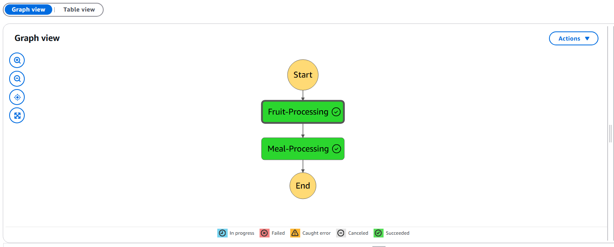

# python-devops
0 to hero DevOps Practice
1. SWE
2. Culture
3. Automation

## Create project scaffold
* Create dev env that's cloud based
### Colab ntbk
* Sample of how to use [colab](https://github.com/andyrews/python-devops/blob/3426724168b5a7a05778c21ac788925610dde6ad/getting_started_python.ipynb)
### GitHub Codespaces
Build Python Project Scaffold:
* Makefile
* requirements.txt
* test libary
* python_library
* Dockerfile
* command-line-tool
* microservices

1. Create Virtual Environment (venv): python -m venv venv
2. Enter to console terminal:
On Windows:
```sh
venv/Scripts/activate
```
On MacOS/Linux:
```sh
source venv/bin/activate
```
3. Clone Project then `make all`
   
### AWS CloudShell
### AWS Cloud9

## Command-Line Tools and Step Functions


## Microservices

## Containerized CD
